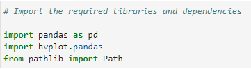
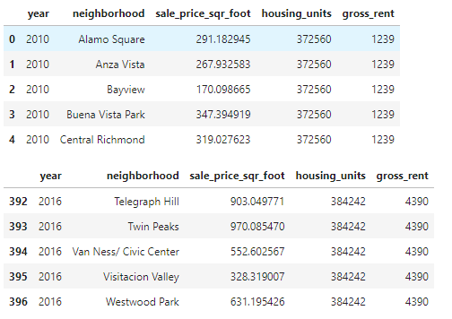
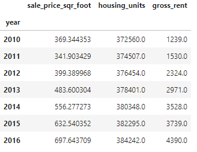
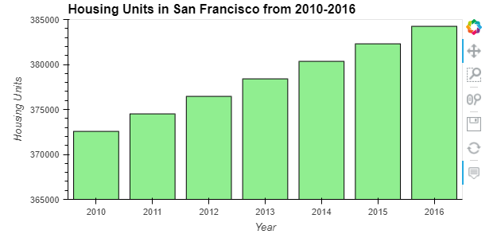
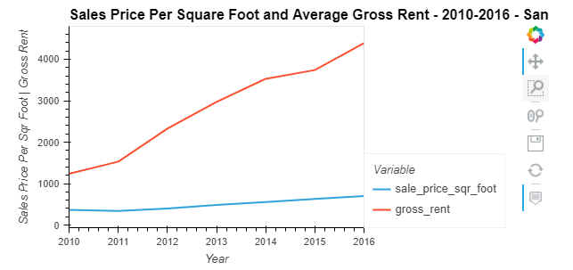
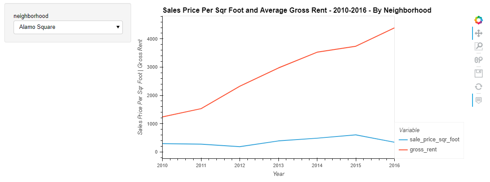
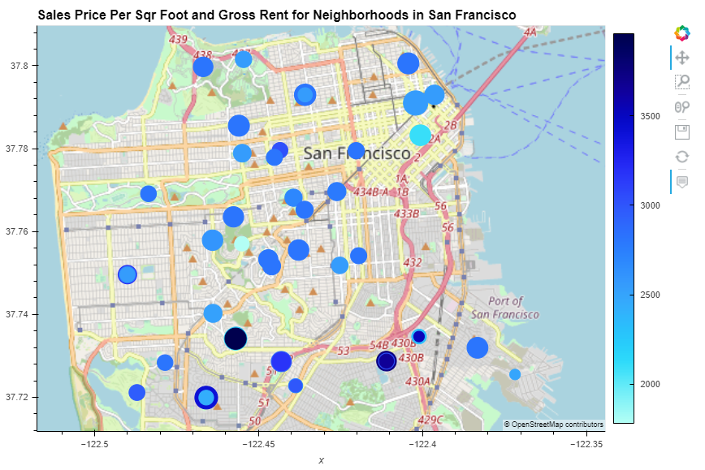

# challenge_6
This program analyzes the housing rental market data for San Francisco. The analysis also includes professionally styled and formatted interactive visuals.

---
## Technologies
This program utilizes Jupyter Notebook with Python.

Here is a list of the required libraries to run the program
- pandas
- hvplot.pandas
- Path from pathlib

---
## Installation Guide
No installation is required. All this is necessary is you need open the application folder with Jupyter Lab and you have the correct csv file in the resources folder.

---
## Usage
After importing the required libraries we read the csv file from the resources folder and display the data.

Next, we group the data by year and calculate the average values, we then display the new DataFrame.

We then use this new dataframe to create a bar plot that visualizes the housing units data from 2010 until 2016.

After dropping the housing_units column we create a line graph that compares the average gross rent and the sales price per square foot in San Francisco from 2010-2016.

Next, we replicate the previous graph but this time there is a widget that allows you to visualize each neighborhood's data individually.

In our final step we use the 'neighborhood_coordinates.csv' to create a points visualization that utilizes geographical data and compares gross rent and sales price per square foot.

---
## Contributors
Kevin Gross

## License
MIT license